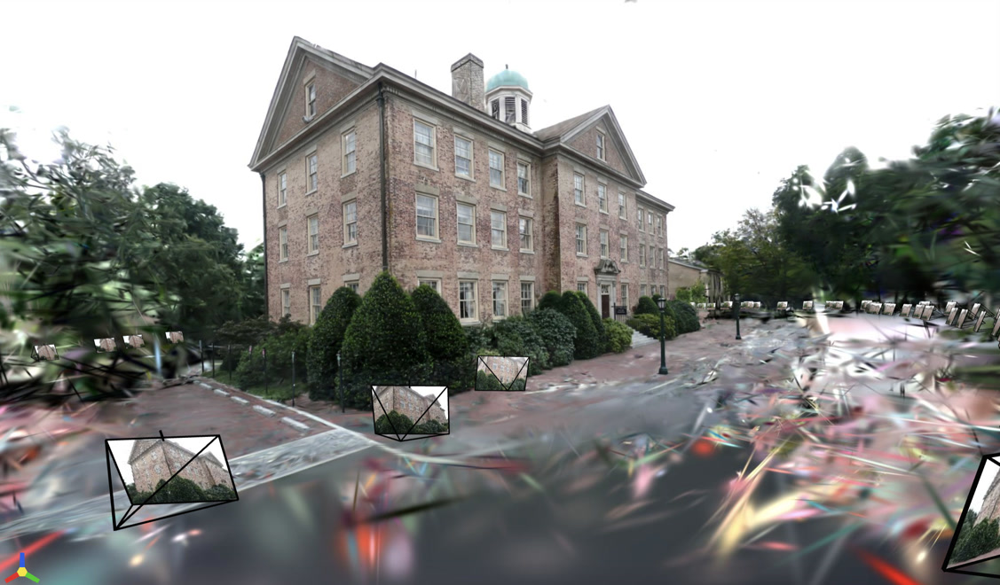

# My COLMAP Guide

## Build and Install COLMAP

COLMAP can be built from:
- `main` branch (latest updates, may be unstable).
- Release tags (recommended for stability, e.g., `3.11.1`).

This guide uses COLMAP `3.11.1`.

1. Install system dependencies:

    ```
    sudo apt update && sudo apt install \
        cmake \
        ninja-build \
        build-essential \
        libboost-program-options-dev \
        libboost-graph-dev \
        libboost-system-dev \
        libeigen3-dev \
        libflann-dev \
        libfreeimage-dev \
        libmetis-dev \
        libgoogle-glog-dev \
        libgtest-dev \
        libgmock-dev \
        libsqlite3-dev \
        libglew-dev \
        qtbase5-dev \
        libqt5opengl5-dev \
        libcgal-dev \
        libceres-dev
    ```

2. Ensure the NVIDIA driver and CUDA toolkit are installed on your system. If
   they are not already in your environment variables, add them as follows:

    ```bash
    export PATH=/usr/local/cuda-11.8/bin:$PATH
    export LD_LIBRARY_PATH=/usr/local/cuda-11.8/lib64:$LD_LIBRARY_PATH
    ```

3. Build COLMAP:

    - First, determine the correct value for `CMAKE_CUDA_ARCHITECTURES` by
      running:

        ```bash
        $ nvidia-smi --query-gpu=compute_cap --format=csv
        compute_cap
        8.9
        ```

        It shows the compute capability is `8.9` so you should use `89`.

    - Next, configure the build with CMake and Ninja:

        ```bash
        cmake -S . -B build/ -GNinja \
        -DCMAKE_INSTALL_PREFIX=./install_colmap \
        -DCMAKE_CUDA_ARCHITECTURES=89

        cmake --build build/ --parallel $(nproc) && cmake --install build/
        ```

        This command installs COLMAP into the `./install_colmap` directory. To
        use COLMAP, add its bin folder to the system PATH: 

        ```bash
        export PATH=`pwd`/install_colmap/bin:$PATH
        ```

    - If you encounter an OpenGL-related error like this:

        ```
        -- Found Glog
        --   Target : glog::glog
        CMake Error at /usr/local/share/cmake-3.30/Modules/FindPackageHandleStandardArgs.cmake:233 (message):
        Could NOT find OpenGL (missing: OPENGL_opengl_LIBRARY OPENGL_glx_LIBRARY)
        Call Stack (most recent call first):
        /usr/local/share/cmake-3.30/Modules/FindPackageHandleStandardArgs.cmake:603 (_FPHSA_FAILURE_MESSAGE)
        /usr/local/share/cmake-3.30/Modules/FindOpenGL.cmake:579 (FIND_PACKAGE_HANDLE_STANDARD_ARGS)
        cmake/FindDependencies.cmake:32 (find_package)
        CMakeLists.txt:105 (include)


        -- Configuring incomplete, errors occurred!
        ```

        It means CMake fails to find the OpenGL libraries. Thus, you need to
        manually specify their paths. First, locate the libraries on your
        system, then add them as flags when running CMake:

        ```bash
        cmake -S . -B build/ -GNinja \
            -DCMAKE_INSTALL_PREFIX=./install_colmap \
            -DOPENGL_opengl_LIBRARY=/usr/lib/x86_64-linux-gnu/libGL.so.1 \
            -DOPENGL_glx_LIBRARY=/usr/lib/x86_64-linux-gnu/libGLX.so.0 \
            -DCMAKE_CUDA_ARCHITECTURES=89
        ```

## Running COLMAP with the Official `South Building` Dataset

This section explains how to perform **sparse** and **dense** 3D reconstruction
using COLMAP’s CLI with the "South Building" dataset.

First, download the "South Building" dataset from the [official COLMAP
website](https://colmap.github.io/datasets.html).

After extraction, the folder structure will look like this:

```
colmap$ ls datasets/south-building
database.db  images  sparse
```

- `images/`: Contains unordered, unposed images.
- `database.db` and `sparse/`: Generated by COLMAP during sparse reconstruction
  (can be deleted before starting). 

### Sparse Reconstruction

The goal of sparse reconstruction is to estimate sparse 3D points and camera
poses from unordered images.

1. Set Dataset Path

    ```
    COLMAP_DATASET_PATH=datasets/south-building
    ```

2. Feature Extraction

    Extract image features and store them in the database:

    ```bash
    colmap feature_extractor \
        --database_path $COLMAP_DATASET_PATH/database.db \
        --image_path $COLMAP_DATASET_PATH/images/
    ```

- Feature Matching

    Perform exhaustive pairwise feature matching:

    ```bash
    colmap exhaustive_matcher \
        --database_path $COLMAP_DATASET_PATH/database.db
    ```

- Mapper

    Run COLMAP's mapper to create a sparse 3D model:

    ```bash
    mkdir $COLMAP_DATASET_PATH/sparse
    colmap mapper \
        --database_path $COLMAP_DATASET_PATH/database.db \
        --image_path $COLMAP_DATASET_PATH/images/ \
        --output_path $COLMAP_DATASET_PATH/sparse/
    ```

    Ideally, COLMAP generates a single model in `sparse/0`. If multiple
    sub-models (e.g., `sparse/1`) appear, it means COLMAP has created
    disconnected reconstructions. Refer to [this
    guide](https://colmap.github.io/faq.html#merge-disconnected-models) to merge
    them.

    At this stage, you have a sparse 3D point cloud and camera poses, which can
    be used for tasks like 3D Gaussian Splatting. For example, the image below
    shows a novel view of the South Building rendered using 3D Gaussian
    Splatting.

    


- Convert Binary to Text
    
    By default, COLMAP outputs binary model files (`*.bin`). Converting them to
    text format makes them easier to inspect.

    ```bash
    mkdir -p $COLMAP_DATASET_PATH/sparse/0_txt \
    && colmap model_converter \
        --input_path $COLMAP_DATASET_PATH/sparse/0 \
        --output_path $COLMAP_DATASET_PATH/sparse/0_txt \
        --output_type TXT
    ```

### Dense Reconstruction

TBD

## Running COLMAP with 360° Images

This section explains how to perform sparse 3D reconstruction using 360° images
captured with an Insta360 X4.

### Preprocess 360° Images

The Insta360 X4 captures 360° videos using two fisheye cameras. The first step
is to stitch these fisheye images into an equirectangular representation,
resulting in a panorama with a 2:1 aspect ratio.

Once the equirectangular image is ready, we can crop perspective images from it
at user-specified pitch and yaw angles. When cropping, the intrinsic matrix is
determined solely by the FOV and the image dimensions.

For example, if we crop a perspective image with:

```
FOV: 90°
Height: 720 px
Width: 720 px
```

The intrinsic matrix would be:

```
360   0 360
  0 360 360
  0   0   1
```

### Sparse Recontruction

The process is similar to the "South Building" dataset but with a few key
differences, which this section highlights.

1. Feature Extraction

    ```bash
    COLMAP_DATASET_PATH=datasets/insta360

    colmap feature_extractor \
        --database_path $COLMAP_DATASET_PATH/database.db \
        --image_path $COLMAP_DATASET_PATH/images/ \
        --ImageReader.single_camera 1 \
        --ImageReader.camera_model PINHOLE \
        --ImageReader.camera_params "360,360,360,360"
    ```

    Since perspective images are cropped from a panorama using a perfect pinhole
    model, we can treat all images as captured by a single pinhole camera. See
    COLMAP's [camera models]((https://colmap.github.io/cameras.html)) for
    details.

2. Feature Matching

    ```bash
    colmap exhaustive_matcher \
        --database_path $COLMAP_DATASET_PATH/database.db \
        --SiftMatching.guided_matching 1
    ```

    Guided matching uses geometric verification to refine feature matches.

3. Mapper

    ```bash
    mkdir -p $COLMAP_DATASET_PATH/sparse/
    colmap mapper \
        --database_path $COLMAP_DATASET_PATH/database.db \
        --image_path $COLMAP_DATASET_PATH/images/ \
        --output_path $COLMAP_DATASET_PATH/sparse/ \
        --Mapper.ba_refine_focal_length 0 \
        --Mapper.ba_refine_principal_point 0 \
        --Mapper.ba_refine_extra_params 0 \
    ```

    Here, bundle adjustment (BA) does not refine camera intrinsics to maintain
    consistency with the predefined pinhole model.

## Developing COLMAP in VSCode

1. Build COLMAP
    Run the following command to build COLMAP with compile commands enabled:

    ```bash
    cmake -DCMAKE_EXPORT_COMPILE_COMMANDS=ON \
        -DOPENGL_opengl_LIBRARY=/usr/lib/x86_64-linux-gnu/libGL.so.1 \
        -DOPENGL_glx_LIBRARY=/usr/lib/x86_64-linux-gnu/libGLX.so.0 \
        -DCMAKE_CUDA_ARCHITECTURES=89 .
    ```

2. Configure VSCode
    - Open the `colmap/` folder in VSCode.
    - Add the following line to `.vscode/c_cpp_properties.json`:
    ```
    compileCommands": "${workspaceFolder}/compile_commands.json
    ```

    The complete ".vscode/c_cpp_properties.json" is shown below:
    ```text
    $ cat .vscode/c_cpp_properties.json
    {
        "configurations": [
            {
                "name": "Linux",
                "compileCommands": "${workspaceFolder}/compile_commands.json",
                "includePath": [
                    "${workspaceFolder}/**"
                ],
                "defines": [],
                "compilerPath": "/usr/bin/gcc",
                "cStandard": "c17",
                "cppStandard": "gnu++17",
                "intelliSenseMode": "linux-gcc-x64"
            }
        ],
        "version": 4
    }
    ```
